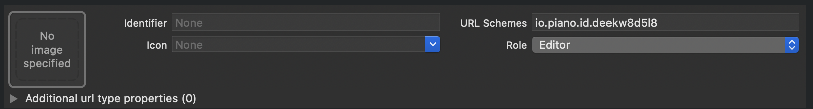

# Piano SDK for iOS
Piano SDK includes dynamic frameworks written in Swift.

- **[PianoCommon](http://cocoapods.org/pods/PianoCommon):** common components for the SDK 

[](http://cocoapods.org/pods/PianoCommon)
[](http://cocoapods.org/pods/PianoCommon)
[](http://cocoapods.org/pods/PianoCommon)

- **[PianoComposer](http://cocoapods.org/pods/PianoComposer):** provides access to the mobile composer (Apple TV support)

[](http://cocoapods.org/pods/PianoComposer)
[](http://cocoapods.org/pods/PianoComposer)
[](http://cocoapods.org/pods/PianoComposer)

- **[PianoTemplate](http://cocoapods.org/pods/PianoTemplate):** template components

[](http://cocoapods.org/pods/PianoTemplate)
[](http://cocoapods.org/pods/PianoTemplate)
[](http://cocoapods.org/pods/PianoTemplate)

- **[PianoTemplate.ID](http://cocoapods.org/pods/PianoTemplate.ID):** template components for Piano ID

[](http://cocoapods.org/pods/PianoTemplate.ID)
[](http://cocoapods.org/pods/PianoTemplate.ID)
[](http://cocoapods.org/pods/PianoTemplate.ID)

- **[PianoOAuth](http://cocoapods.org/pods/PianoOAuth):** component for authentication with user providers Piano ID and Piano Accounts. Frameworks can be used for development iOS applications on Objective-c and Swift.

[](http://cocoapods.org/pods/PianoOAuth)
[](http://cocoapods.org/pods/PianoOAuth)
[](http://cocoapods.org/pods/PianoOAuth)

- **[PianoC1X](http://cocoapods.org/pods/PianoC1X):** component for integration Piano Composer with [Cxense](https://github.com/cXense/cxense-spm).

[](http://cocoapods.org/pods/PianoC1X)
[](http://cocoapods.org/pods/PianoC1X)
[](http://cocoapods.org/pods/PianoC1X)

This document details the process of integrating the Piano SDK with your iOS application. If you have any questions, don't hesitate to email us at support@piano.io.

## Requirements
- iOS 10.0+
- Xcode 13.0
- Swift 5.5

## Installation

### [CocoaPods](https://cocoapods.org/)

Add the following lines to your `Podfile`.

```
use_frameworks!

pod 'PianoComposer', '~> 2.5.1'
pod 'PianoTemplate', '~> 2.5.1'
pod 'PianoTemplate.ID', '~> 2.5.1'
pod 'PianoOAuth', '~> 2.5.1'
pod 'PianoC1X', '~> 2.5.1'
```

Then run `pod install`. For details of the installation and usage of CocoaPods, visit [official web site](https://cocoapods.org/).

### [Swift Package Manager](https://developer.apple.com/documentation/swift_packages/adding_package_dependencies_to_your_app)
Add the components you need from the repository:

**URL:** https://gitlab.com/piano-public/sdk/ios/package

**Version:** 2.5.0

## PianoComposer Usage

##### Imports
```swift
// swift
import PianoComposer
```
```obj-c
// objective-c
@import PianoComposer;
```

##### Endpoints
```swift
PianoEndpoint.production // Production endpoint
PianoEndpoint.productionAustralia // Production endpoint for Australia region
PianoEndpoint.productionAsiaPacific // Production endpoint for Asia/Pacific region
PianoEndpoint.sandbox // Sandbox endpoint
```

##### Initialize
```swift
PianoComposer(aid: "<PUBLISHER_AID>") // Production endpoint is used by default (PianoEndpoint.production)
// or
PianoComposer(aid: "<PUBLISHER_AID>", endpoint: PianoEndpoint.sandbox)
```

##### Usage
```swift
var composer = PianoComposer(aid: "<PUBLISHER_AID>")
.delegate(self) // conform PianoComposerDelegate protocol
.tag("tag1") // add single tag
.tag("tag2") // add single tag
.tags(["tag3", "tag4"]) //add array of tags
.zoneId("Zone1") // set zone
.referrer("http://sitename.com") // set referrer
.url("http://pubsite.com/page1") // set url
.customVariable(name: "customId", value: "1") // set custom variable
.userToken("userToken") // set user token
```

##### Composer execution
```swift 
composer.execute()
``` 

##### PianoComposerDelegate protocol
```swift
// Client actions
optional func composerExecutionCompleted(composer: PianoComposer)

// Composer actions from server 
optional func showLogin(composer: PianoComposer, event: XpEvent, params: ShowLoginEventParams?)
optional func showTemplate(composer: PianoComposer, event: XpEvent, params: ShowTemplateEventParams?)
optional func showForm(composer: PianoComposer, event: XpEvent, params: ShowFormEventParams?)
optional func showRecommendations(composer: PianoComposer, event: XpEvent, params: ShowRecommendationsEventParams?)
optional func nonSite(composer: PianoComposer, event: XpEvent)
optional func userSegmentTrue(composer: PianoComposer, event: XpEvent)
optional func userSegmentFalse(composer: PianoComposer, event: XpEvent)    
optional func meterActive(composer: PianoComposer, event: XpEvent, params: PageViewMeterEventParams?)
optional func meterExpired(composer: PianoComposer, event: XpEvent, params: PageViewMeterEventParams?)    
optional func experienceExecute(composer: PianoComposer, event: XpEvent, params: ExperienceExecuteEventParams?)
```

## Templates
For more information about templates, see the documentation at the **[link](TEMPLATES.md)**.

## PianoOAuth Usage

#### Imports
```swift
// swift
import PianoOAuth
```
```
// objective-c
@import PianoOAuth;
```

#### Piano ID user provider

##### Piano ID
PianoID requires a custom URL Scheme to be added to your project. To add: open your project configuration select your app from the TARGETS section, then select the Info tab, and expand the URL Types section. 

Set ```io.piano.id.<PUBLISHER_AID_LOWERCASE>```
as URL schemes. For example:


To enable social sign in, you must configure the PianoID shared instance before usage.

```swift
PianoID.shared.aid = "<PUBLISHER_AID>"
PianoID.shared.delegate = self
```

Also you must implement the ```application(_:open:options:)``` method of your app delegate
```swift
func application(_ app: UIApplication, open url: URL, options: [UIApplication.OpenURLOptionsKey : Any] = [:]) -> Bool {
    return PianoOAuth.PianoIDApplicationDelegate.shared.application(app, open: url, options: options)
}

```
For iOS 8 and older  you must implement the  deprecated ```application(_:open:sourceApplication:annotation:)``` method of your app delegate
```swift
func application(_ application: UIApplication, open url: URL, sourceApplication: String?, annotation: Any) -> Bool {
    return PianoOAuth.PianoIDApplicationDelegate.shared.application(application, open: url, sourceApplication: sourceApplication, annotation: annotation)
}
```


To sign in:
```swift
PianoID.shared.signIn()
```

To sign out:
```swift
PianoID.shared.signOut(token: "<TOKEN>")
```

Additional settings:
```swift
PianoID.shared.isSandbox = true // for using sandbox application
PianoID.shared.widgetType = .login // or .register for choosing default screen 
PianoID.shared.signUpEnabled = false // for enabling/disabling signUp
```
##### Native Google Sign In SDK
You must implement the ```application(_:didFinishLaunchingWithOptions:)``` method of your app delegate
```swift
func application(_ application: UIApplication, didFinishLaunchingWithOptions launchOptions: [UIApplication.LaunchOptionsKey: Any]?) -> Bool {
    PianoID.shared.googleClientId = "<PUBLISHER_GOOGLE_CLIENT_ID>"    
    return true
}
```
Information about <PUBLISHER_GOOGLE_CLIENT_ID> can be found here:  https://developers.google.com/identity/sign-in/ios/start-integrating#get_an_oauth_client_id


Also you should configure URL scheme as described here:  https://developers.google.com/identity/sign-in/ios/start-integrating#add_a_url_scheme_to_your_project

##### Native Facebook Sign In SDK
You must implement the ```application(_:didFinishLaunchingWithOptions:)``` method of your app delegate
```swift
func application(_ application: UIApplication, didFinishLaunchingWithOptions launchOptions: [UIApplication.LaunchOptionsKey: Any]?) -> Bool {    
    PianoOAuth.PianoIDApplicationDelegate.shared.application(application, didFinishLaunchingWithOptions: launchOptions)
    return true
}
```
Also you should configure your application as described here: https://developers.facebook.com/docs/swift/register-your-app#configuresettings

##### Passwordless Login in SDK
These settings should be configured in Piano ID according to https://docs.piano.io/enabling-passwordless-checkout/. The current configuration is applied in mobile application without additional settings 

##### PianoIDDelegate protocol
```swift
func signIn(result: PianoIDSignInResult!, withError error: Error!);

func signOut(withError error: Error!);

func cancel();
```

##### User information
To get user information, use the function ```PianoID.userInfo```
```swift
PianoID.shared.userInfo(aid: params.aid, accessToken: t.accessToken, formName: params.formName) { result, err in
    if let e = err {
        // handle error
        return
    }
    
    // handle user information result
}
```

#### Piano accounts user provider **(deprecated)**
##### Usage
```swift
let vc = PianoOAuthPopupViewController(aid: "<PUBLISHER_AID>") // for piano accounts user provider
...
vc.delegate = someDelegate // conform PianoOAuthDelegate protocol
vc.signUpEnabled = true // makes "sign up" button enabled (default: false)
vc.widgetType = .login // widget type (possible values: ".login", ".register")
vc.showPopup()
```
##### PianoOAuthDelegate protocol
```swift
func loginSucceeded(accessToken: String)
func loginCancelled() 
```

## Cxense integration
For more information about Cxense integration (C1X), see the documentation at the **[link](C1X.md)**.
